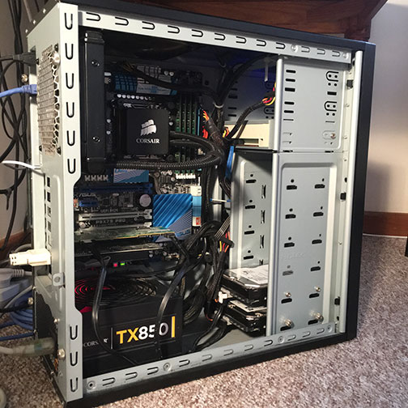

I am Jim Bishop, a technology professional now based in **Perth Western Australia** with ten plus years experience in the Information Technology field. I have wide and varied experience from mending small home PC's and Macs to setting up advanced cluster computing to be used on feature films. I am now here to help you or your business with the day to day technology questions and problems that we deal with in the high technology world in which we currently live.

Some of the services which I offer can be seen in the **Services** link above.

You can also *Email* me, check out the *Instagram* or go to my *LinkedIn* via the buttons below.

 
